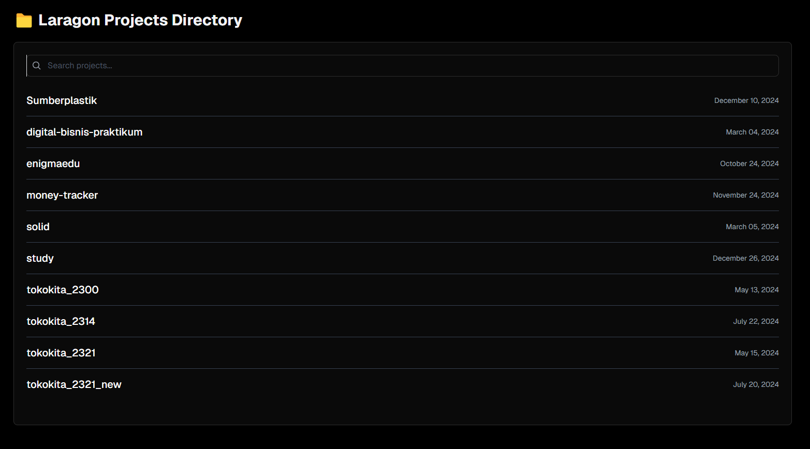

 
<h1 align="center">📁 Laragon Project List  </h1>

 Biar tampilan utama laragon jadi lebih bagus untuk tampilin list project klean

# Cara Pakai

1. **Pastikan Laragon Sudah Terinstall**
   - Kalau belum, download dan install Laragon dari [sini](https://laragon.org/download/).

2. **Masuk ke Folder `www` Laragon**
   - Buka **File Explorer**, lalu buka folder `C:\laragon\www`.

3. **Ganti `index.php` yang Ada**
   - Di dalam folder `www`, kamu bakal nemuin file `index.php` (klo gda buat ya).
   - Ganti isi file `index.php` ini dengan file `index.php` yang di repository ini
   
4. **Jalankan Laragon**
   - Buka Laragon dan klik **Start All** untuk menjalankan Apache dan MySQL.
   
5. **Buka di Browser**
   - Buka browser dan akses `http://localhost/`.

