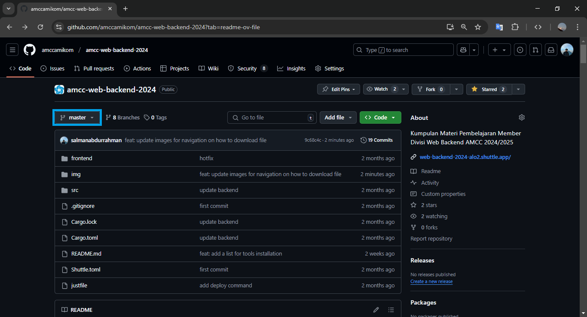
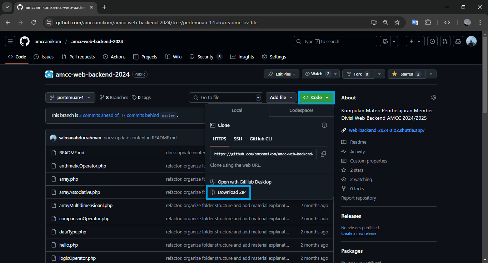
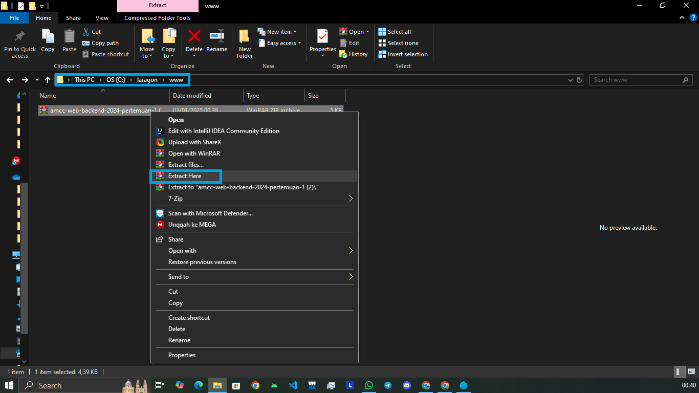
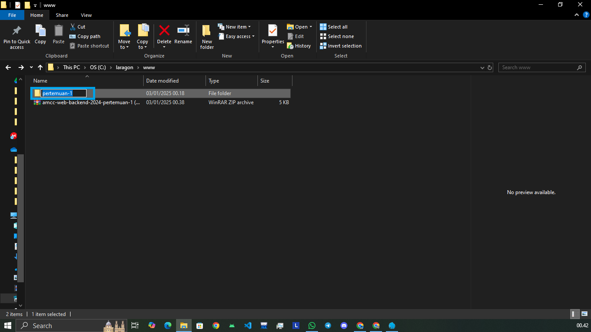

# Materi Web Backend 2024

Selamat datang di repository **Materi Web Backend 2024**. Repository ini dirancang untuk membantu teman-teman untuk mengejar materi yang tertinggal atau meninjau ulang pembelajaran dari pertemuan sebelumnya. Semua file dan materi disusun berdasarkan pertemuan untuk mempermudah navigasi.

<div align="center">
  <picture>
    <source media="(prefers-color-scheme: dark)" srcset="https://media1.tenor.com/m/u_JghTVUgcgAAAAC/oresuki-himawari.gif">
    
  </picture>
</div>

> **Catatan**: Pilih branch sesuai dengan pertemuan yang teman-teman butuhkan sebelum mengunduh materi.

## Hal yang Akan Dipelajari

   

## 🚀 Cara Mengunduh Materi

Ikuti langkah-langkah berikut untuk mengunduh materi dari repository ini dalam format ZIP:

##### 1. Pilih Branch yang Sesuai

1. Klik menu **"Branch"** di halaman utama repository.
2. Pilih branch yang sesuai dengan pertemuan yang dibutuhkan (contoh: `pertemuan-1`, `pertemuan-2`, dst).



##### 2. Cari Folder Materi

Navigasikan ke folder atau file yang sesuai dengan materi yang ingin diunduh.


##### 3. Unduh File ZIP

1. Klik tombol **"Code"** di kanan atas repository.
2. Pilih opsi **"Download ZIP"**.



##### 4. Ekstrak File ZIP

Setelah unduhan selesai, ekstrak file ZIP di komputer teman-teman untuk mengakses semua file materi.

## 🚀 Cara Menjalankan File

Setelah mengunduh dan mengekstrak materi dari repository, ikuti langkah-langkah berikut untuk menjalankan file di sistem lokal menggunakan **Laragon**:

##### 1. Ekstrak File ZIP ke Folder `www` Laragon

-   Setelah file ZIP berhasil diunduh, ekstrak file tersebut.
-   Tempatkan hasil ekstrak di dalam folder `www` pada direktori Laragon di komputer Anda.
-   Contoh lokasi folder:
    -   **Windows**: `C:\laragon\www`
    -   **Linux/Mac**: (sesuaikan lokasi folder instalasi Laragon Anda).



##### 2. Ubah Nama Folder Hasil Ekstrak

-   Untuk mempermudah akses di browser, ubah nama folder hasil ekstrak.
-   **Contoh**:
    -   Dari: `amcc-web-backend-2024-pertemuan-1`
    -   Menjadi: `pertemuan-1`



##### 3. Jalankan Laragon

-   Buka aplikasi **Laragon**.
-   Klik tombol **Start All** untuk mengaktifkan server.


##### 4. Akses Materi di Browser

-   Buka browser favorit Anda (Google Chrome, Firefox, dll.).
-   Ketikkan URL berikut di address bar:

    ```plaintext
    http://localhost/pertemuan-1
    ```

-   **Catatan**: Ganti `pertemuan-1` dengan nama folder yang telah Anda buat sesuai materi yang diunduh.


##### 5. Baca Dokumentasi di File `README.md`

-   Setiap materi yang diunduh memiliki file `README.md`.
-   File ini berisi dokumentasi atau panduan singkat mengenai isi repository tersebut, termasuk tujuan materi dan struktur file.

## 🗂️ Daftar Materi Berdasarkan Pertemuan

#### **Pertemuan 1: Dasar PHP**

-   **Topik**: Pengenalan dasar PHP
-   **Materi**:
    -   Program Hello World
    -   Tipe Data (integer, float, boolean, string)
    -   Variabel
    -   NULL
    -   Operator (aritmatika, perbandingan, logika)
    -   Expression, statement, block
    -   Array (dasar, asosiatif, multidimensional)
-   **Link Modul**: [Dasar PHP - Medium](https://medium.com/amcc-amikom/dasar-dasar-php-2024-langkah-awal-menuju-backend-developer-648cb402ae6c)

#### **Pertemuan 2: Dasar PHP Lanjutan**

-   **Topik**: Struktur kontrol dan fungsi
-   **Materi**:
    -   If statement
    -   Switch statement
    -   Ternary operator
    -   Perulangan (for, while, do while, foreach)
    -   Fungsi
    -   Variable handling (isset, empty, is_null, is_array, dll)
-   **Link Modul**: [Dasar PHP Lanjutan - Medium](https://medium.com/amcc-amikom/dasar-dasar-php-lanjutan-9d402dcec102)

#### **Pertemuan 3: Konsep OOP di PHP**

-   **Topik**: Pengenalan OOP di PHP
-   **Materi**:
    -   Class dan Object
    -   Property & Method
    -   Konstruktor
    -   Namespace dan `use` keyword
    -   Visibilitas
-   **Link Modul**: [Konsep OOP di PHP - Medium](#)

#### **Pertemuan 4: Database dan Migrasi**

-   **Topik**: Pengenalan database
-   **Materi**:
    -   Pengenalan Database (Relational, Non-Relational)
    -   Pengenalan MySQL dan PHPMyAdmin
    -   Membuat database dan tabel
    -   Query (DDL, DML)
    -   Tipe Data MySQL
    -   Relationship (Primary key, foreign key, dst.)
    -   Klausa SQL (where, group by, order by, dst.)
    -   Operator SQL (perbandingan, logika, aritmatika, dst.)
-   **Link Modul**: [Database dan Migrasi - Medium](#)

#### **Pertemuan 5: Pengenalan Laravel**

-   **Topik**: Memulai Laravel
-   **Materi**:
    -   Composer
    -   Instalasi Laravel
    -   Pengenalan Laravel (MVC dan API)
    -   Struktur folder Laravel
    -   PHP artisan
    -   Routing dasar dan konfigurasi
-   **Link Modul**: [Pengenalan Laravel - Medium](#)

#### **Pertemuan 6: RESTful API Dasar**

-   **Topik**: Membuat API pertama
-   **Materi**:
    -   Konsep RESTful API
    -   Resource Routes
    -   CRUD menggunakan API
    -   Testing API dengan Postman (tanpa coding test)
-   **Link Modul**: [RESTful API Dasar - Medium](#)

#### **Pertemuan 7: Controller dan Request**

-   **Topik**: Mengelola Request
-   **Materi**:
    -   Membuat Controller dengan Artisan
    -   Konfigurasi di Route
    -   Mengambil input dari request
    -   Validasi input
-   **Link Modul**: [Controller dan Request - Medium](#)

#### **Pertemuan 8: Database di Laravel**

-   **Topik**: Mengelola database dengan Laravel
-   **Materi**:
    -   Konfigurasi database di `.env`
    -   Rollback dan refresh migrasi
    -   Seeder dan implementasinya
    -   Fetching data (query `where()`)
    -   Migrasi database (artisan, skema tabel, foreign key)
    -   Insert, select, update, delete
    -   Factory
-   **Link Modul**: [Database di Laravel - Medium](#)

#### **Pertemuan 9: Eloquent ORM & Relationship**

-   **Topik**: Eloquent ORM dan relasi
-   **Materi**:
    -   Pengenalan Eloquent ORM
    -   Model dan `$fillable`
    -   CRUD dengan Eloquent
    -   Eloquent Relationship (one-to-many, belongs-to)
    -   Tips mengatasi masalah N+1 problem
-   **Link Modul**: [Eloquent ORM & Relationship - Medium](#)

#### **Pertemuan 10: Dokumentasi API**

-   **Topik**: Dokumentasi API
-   **Materi**:
    -   Membuat dokumentasi API menggunakan Postman
-   **Link Modul**: [Dokumentasi API - Medium](#)

#### **Pertemuan 11-12: Final Project**

-   **Topik**: Proyek Akhir RESTful API
-   **Materi**:
    -   Membuat RESTful API lengkap
    -   Dokumentasi dan pengujian
-   **Link Modul**: [Final Project - Medium](#)

Semoga repository ini membantu dalam perjalanan belajar teman-teman semuanya! 🎉
